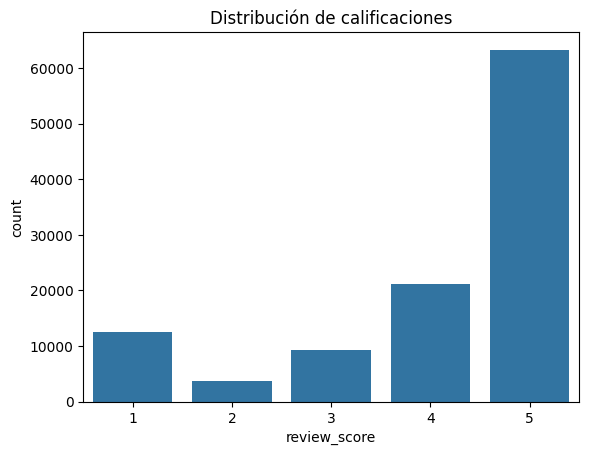
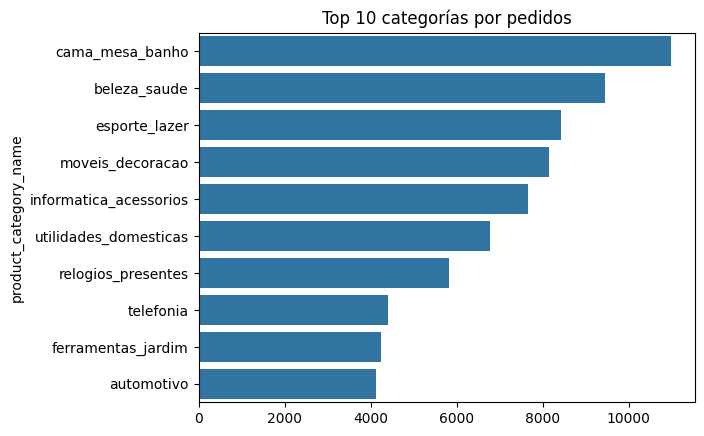
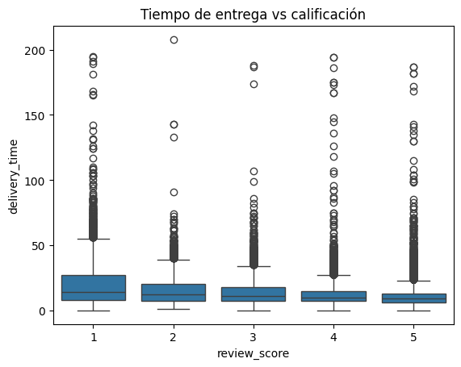
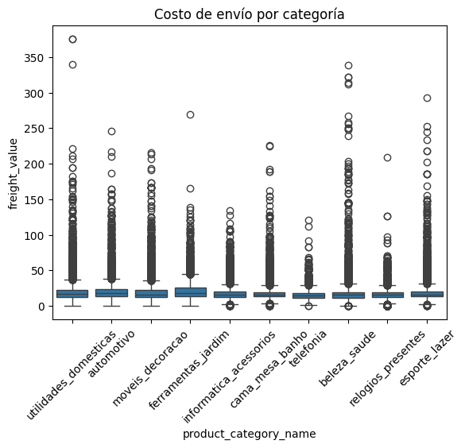
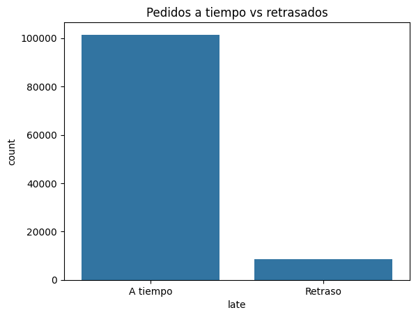

**Caso 1: ¿Qué hace que un producto triunfe en e-commerce?**

**1\. Portada del equipo**

Integrantes:

Valeria Ayala   
Diandra Bañez  
Diego Alvarez  
Carlos Carrizales  
Natalia Ccusi

**Roles:**

 **Líder de proyecto:** (Carlos) – Coordinación y entregables  
 **Analista de datos:** (Valeria) – Limpieza y EDA  
 **Ingeniero de datos:** ( Diego ) – Integración de datasets  
 **Analista de negocio:** (Diandra) – Insights y recomendaciones

1. **Descripción del problema de negocio**

El problema de negocio se centra en identificar qué factores influyen en el éxito de un producto dentro de un marketplace de e-commerce, tomando como referencia plataformas similares a Olist en Brasil. En este tipo de empresas, los vendedores compiten dentro de una misma plataforma y dependen de variables como el precio, el costo de envío, la categoría del producto, el tiempo de entrega y la experiencia del cliente para lograr ventas sostenibles y buenas calificaciones.

Este problema es relevante porque la satisfacción del cliente impacta directamente en la reputación del vendedor, la recompra y la rentabilidad del marketplace. Una mala experiencia, como una entrega tardía, un costo de envío elevado o una baja calidad percibida, puede generar calificaciones negativas y reducir la confianza del consumidor. Por otro lado, entender qué factores generan mejores reseñas permite priorizar mejoras logísticas, comerciales y de atención al cliente.

En este contexto, analizar cómo variables como el precio, el tiempo de entrega, la categoría del producto y la calificación del cliente afectan el desempeño de los productos permite tomar mejores decisiones de negocio. Esto puede ayudar a los marketplaces y vendedores digitales a optimizar su oferta, mejorar la experiencia de compra y escalar sus ventas de forma más eficiente.

2.  **Descripción de los datos**

**Fuente principal:**

El dataset principal corresponde a Brazilian E-Commerce Public Dataset by Olist, disponible en Kaggle. Este conjunto de datos contiene información de pedidos realizados en Brasil, incluyendo datos de órdenes, productos, clientes, vendedores, pagos, envíos y reseñas.

**Fuentes de enriquecimiento:**

Para complementar el análisis, se incorporan datos externos como:

* Calendario comercial de Brasil, considerando fechas como Black Friday, Navidad y otras temporadas de alta demanda.  
* Días festivos nacionales en Brasil, para analizar posibles variaciones en volumen de pedidos y tiempos de entrega.  
* Información referencial del tipo de cambio BRL/PEN, para contextualizar precios desde una perspectiva regional.

**Número de registros:**

El dataset cuenta con más de 100,000 órdenes registradas, lo que permite realizar análisis robustos sobre comportamiento de compra, satisfacción del cliente, tiempos de entrega y desempeño por categoría.

**Variables Clave:**

* Fecha de compra: permite analizar patrones temporales y temporadas de mayor demanda.  
*  Precio del producto: variable clave para evaluar competitividad y percepción de valor.  
* Costo de envío: puede influir en la satisfacción y decisión de compra.  
* Categoría del producto: permite identificar qué tipos de productos tienen mejor desempeño.  
* Tiempo de entrega: diferencia entre la fecha de compra, fecha estimada y fecha real de entrega.  
*  Calificación del cliente: variable principal para medir satisfacción.  
* Estado del pedido: permite filtrar pedidos entregados, cancelados o con problemas  
* Ubicación del cliente y vendedor: ayuda a analizar distancia, tiempos logísticos y posibles retrasos.

**Limitaciones de los datos:**

* No existe una variable directa de recompra, por lo que se debe aproximar con comportamiento de clientes o reseñas.  
* Algunas categorías presentan valores nulos o nombres incompletos.  
* No todos los pedidos tienen la misma cantidad de información disponible en reseñas o pagos.  
* El dataset representa un periodo específico, por lo que los resultados no necesariamente reflejan el comportamiento actual del mercado.

3. **EDA Inicial**

**Visualización 1: Distribución de calificaciones de clientes**

Esta visualización permite observar cómo se distribuyen las reseñas de los clientes en una escala de 1 a 5\. El objetivo es identificar si la mayoría de compradores tuvo una experiencia positiva o si existe una proporción significativa de clientes insatisfechos.

**Interpretación esperada:**  
Si las calificaciones de 4 y 5 estrellas predominan, se puede afirmar que la mayoría de pedidos generan satisfacción. Sin embargo, las calificaciones bajas deben analizarse con mayor detalle porque pueden estar asociadas a retrasos, costos de envío altos o problemas por categoría.

**Visualización 2: Top 10 categorías con mayor número de pedidos**

Esta visualización muestra las categorías de productos con mayor volumen de ventas dentro del marketplace. Permite identificar qué categorías concentran mayor demanda y cuáles podrían tener mayor importancia estratégica para la empresa.

**Interpretación esperada:**  
Las categorías con mayor número de pedidos pueden representar oportunidades de optimización, ya que cualquier mejora en precio, envío o satisfacción dentro de ellas tendría un impacto importante en el negocio.

**Visualización 3: Relación entre tiempo de entrega y calificación del cliente**

Esta visualización compara los días de entrega con la calificación otorgada por el cliente. El objetivo es analizar si los pedidos que demoran más reciben peores reseñas.

**Interpretación esperada:**  
Si se observa que las calificaciones disminuyen cuando el tiempo de entrega aumenta, se podría concluir que la logística tiene un impacto directo en la satisfacción del cliente.

**Visualización 4: Costo de envío promedio por categoría**

Esta visualización permite comparar cuánto pagan los clientes por envío según la categoría del producto. Algunas categorías pueden tener costos más altos debido al peso, volumen o distancia logística.

**Interpretación esperada:**  
Si ciertas categorías tienen costos de envío elevados y calificaciones más bajas, el marketplace podría revisar estrategias de subsidio, promociones o mejora logística para reducir la fricción en la compra.

**Visualización 5: Pedidos entregados a tiempo vs. pedidos con retraso**

Esta visualización clasifica los pedidos según si fueron entregados antes o después de la fecha estimada. Permite medir el nivel de cumplimiento logístico del marketplace.

**Interpretación esperada:**  
Un alto porcentaje de entregas tardías podría explicar parte de las calificaciones negativas. Además, esta métrica puede ser usada como indicador clave para proponer recomendaciones en la etapa final.

4. **Hipótesis del trabajo**  
   

 **a.**

*  H₀: El tiempo de entrega no tiene efecto significativo sobre la calificación del cliente.  
* H₁: Los pedidos entregados después de la fecha estimada presentan calificaciones más bajas que los pedidos entregados a tiempo, porque el retraso afecta directamente la experiencia de compra.

**b.**

* H₀: El costo de envío no influye significativamente en la satisfacción del cliente.  
* H₁: Los pedidos con costos de envío más altos presentan menor calificación promedio, porque el cliente percibe menor valor cuando el envío representa una proporción alta del costo total.

**c.**

* H₀: La categoría del producto no diferencia el nivel de satisfacción del cliente.  
* H₁: Algunas categorías presentan calificaciones consistentemente más altas que otras, debido a diferencias en expectativas **del cliente, tiempos logísticos y características del producto.**

**5\. Plan de trabajo – Etapa 2 (Semanas 7–14)**

| Semana | Actividad | Responsable |
| :---: | :---: | :---: |
| 7 | Integración de datasets | Diandra |
| 8 | Análisis de variables clave | Valeria |
| 9 | Validación de hipótesis | Carlos |
| 10 | Modelado básico | Diego |
| 11 | Dashboard	 | Natalia |
| 12 | Insights y recomendaciones | Valeria |
| 13 | Presentación | Diandra |
| 14 | Entrega final | Todo el equipo |

